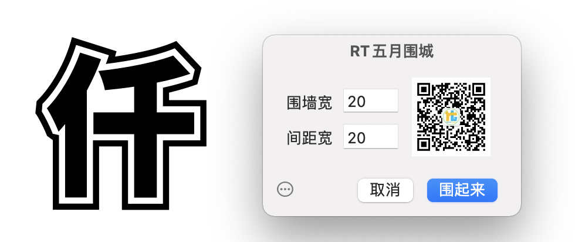

# RTBesieged

#### 介绍
Glyphs3 Filte插件，用于给字形添加围墙（区别于简单的描边功能），因为五月发布的，所以就叫【五月围城】了。由于不同字形产生的滤镜效果不一样，所以不一定适合部分字形的变形延展，仅供闲暇娱乐，不要太较真。

#### 使用说明
可以在编辑界面操作，也可以在字体界面选中字符操作，还可以点击插件左下角小圆圈，拷贝自定义参数，在【字体信息】-【导出项】中的【自定义参数】中粘贴（Command+V），用于导出字体时候执行滤镜（支持include: 和 exclude）。
关于滤镜的自定义参数不明白的，可以查阅：
[https://glyphsapp.com/zh/learn/custom-parameters](https://glyphsapp.com/zh/learn/custom-parameters)

